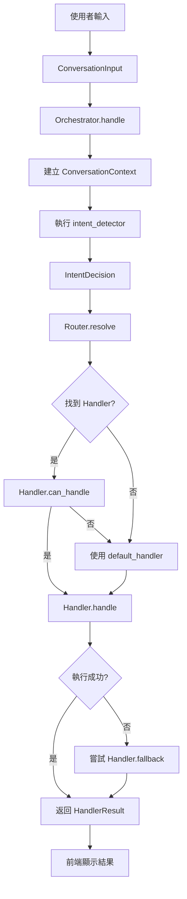

# Conversation Core 對話核心框架 - 架構說明

**建立日期**: 2025年11月16日  
**模組位置**: `backend/conversation_core/`  
**版本**: 1.0

---

## 📋 概述

`conversation_core` 是一個模組化的對話處理框架，提供標準化的方式來處理各種對話意圖。它採用 **Handler 模式** 和 **路由機制**，使得新增對話功能變得簡單且可維護。

### 核心設計理念

1. **職責分離** - 意圖檢測、路由、處理分別獨立
2. **可擴展性** - 輕鬆新增新的 Handler
3. **標準化** - 統一的資料模型和介面
4. **容錯性** - 內建 fallback 機制

---

## 🏗️ 模組結構

```
conversation_core/
├── __init__.py           # 統一匯出介面
├── models.py             # 資料模型 (dataclass)
├── handler_base.py       # Handler 抽象基礎類
├── intent_router.py      # 意圖路由器
└── orchestrator.py       # 對話編排器
```

### 檔案說明

| 檔案 | 職責 | 核心類別 |
|------|------|---------|
| `models.py` | 定義資料結構 | `ConversationInput`, `IntentDecision`, `HandlerResult` |
| `handler_base.py` | Handler 基礎類 | `ConversationHandler` (ABC) |
| `intent_router.py` | 意圖路由邏輯 | `IntentRouter` |
| `orchestrator.py` | 統一處理流程 | `ConversationOrchestrator` |

---

## 📊 資料模型

### 1. ConversationInput

**用途**: 封裝使用者輸入和環境上下文

```python
@dataclass
class ConversationInput:
    user_text: str                              # 使用者輸入文字
    history: List[Dict[str, Any]]              # 對話歷史
    session_id: Optional[str] = None           # 會話 ID
    locale: str = "zh-TW"                      # 語系
    metadata: Dict[str, Any] = field(default_factory=dict)  # 額外資訊
```

**使用範例**:
```python
input_data = ConversationInput(
    user_text="我要買椰子油",
    history=[
        {"role": "user", "content": "你好"},
        {"role": "assistant", "content": "您好！有什麼可以幫您的嗎？"}
    ],
    session_id="session_123",
    metadata={"source": "web", "user_id": "user_456"}
)
```

---

### 2. ConversationContext

**用途**: 可變的上下文，在檢測器和 Handler 之間共享

```python
@dataclass
class ConversationContext:
    input: ConversationInput                    # 輸入資料
    detected_intent: Optional["IntentDecision"] = None  # 檢測到的意圖
    state: Dict[str, Any] = field(default_factory=dict) # 狀態儲存
```

**使用範例**:
```python
ctx = ConversationContext(input=input_data)

# 意圖檢測器填充意圖
ctx.detected_intent = IntentDecision(intent_type="product_search")

# 儲存中間狀態
ctx.state["llm_response"] = llm_result
ctx.state["cached_products"] = products
```

---

### 3. IntentDecision

**用途**: 標準化意圖決策結果

```python
@dataclass
class IntentDecision:
    intent_type: str                            # 意圖類型
    confidence: float = 0.0                     # 置信度 (0-1)
    sub_type: Optional[str] = None             # 子類型
    metadata: Dict[str, Any] = field(default_factory=dict)  # 額外資訊
```

**使用範例**:
```python
# 商品搜尋意圖
intent = IntentDecision(
    intent_type="product_search",
    confidence=0.95,
    sub_type="specific_product",
    metadata={"category": "food", "keywords": ["椰子油"]}
)

# 公司資訊查詢意圖
intent = IntentDecision(
    intent_type="company_info",
    confidence=0.85,
    sub_type="contact",
    metadata={"topic": "address"}
)
```

---

### 4. HandlerResult

**用途**: Handler 的標準化返回結果

```python
@dataclass
class HandlerResult:
    ok: bool                                    # 是否成功
    reply: str                                  # 回覆文字
    payload: Dict[str, Any] = field(default_factory=dict)  # 額外資料
    session_id: Optional[str] = None           # 會話 ID
    trace: Dict[str, Any] = field(default_factory=dict)    # 追蹤資訊
```

**使用範例**:
```python
# 成功回應
result = HandlerResult(
    ok=True,
    reply="找到 5 款符合需求的商品",
    payload={
        "products": [...],
        "total_count": 5,
        "filters_applied": {"category": "food"}
    },
    session_id="session_123",
    trace={
        "handler": "product_search",
        "processing_time_ms": 245
    }
)

# 錯誤回應
result = HandlerResult(
    ok=False,
    reply="抱歉，系統暫時無法處理您的請求",
    payload={"error": "llm_timeout"},
    trace={"handler": "product_search", "error_type": "timeout"}
)
```

---

## 🎯 Handler 系統

### Handler 基礎類

```python
class ConversationHandler(ABC):
    """所有 Handler 的基礎類"""
    
    name: str = "base"  # Handler 名稱
    
    @abstractmethod
    def can_handle(self, intent: IntentDecision, ctx: ConversationContext) -> bool:
        """判斷是否能處理此意圖"""
        pass
    
    @abstractmethod
    def handle(self, ctx: ConversationContext, intent: IntentDecision) -> HandlerResult:
        """執行主要業務邏輯"""
        pass
    
    def fallback(self, ctx: ConversationContext, intent: IntentDecision) -> Optional[HandlerResult]:
        """可選的回退處理"""
        return None
```

### 實作自訂 Handler

#### 範例 1: 商品搜尋 Handler

```python
from conversation_core import ConversationHandler, IntentDecision, ConversationContext, HandlerResult

class ProductSearchHandler(ConversationHandler):
    """商品搜尋 Handler"""
    
    name = "product_search"
    
    def can_handle(self, intent: IntentDecision, ctx: ConversationContext) -> bool:
        """檢查是否為商品搜尋意圖"""
        return intent.intent_type == "product_search"
    
    def handle(self, ctx: ConversationContext, intent: IntentDecision) -> HandlerResult:
        """執行商品搜尋"""
        user_query = ctx.input.user_text
        
        # 從 context 獲取已快取的資料（如果有）
        products = ctx.state.get("products")
        
        if not products:
            # 執行搜尋
            from goods_search_service import search_products
            products = search_products(user_query, topn=10)
        
        if not products:
            return HandlerResult(
                ok=False,
                reply="抱歉，沒有找到符合需求的商品",
                payload={"query": user_query},
                session_id=ctx.input.session_id
            )
        
        return HandlerResult(
            ok=True,
            reply=f"找到 {len(products)} 款商品，推薦給您",
            payload={
                "products": products,
                "query": user_query,
                "total": len(products)
            },
            session_id=ctx.input.session_id,
            trace={"handler": self.name, "products_found": len(products)}
        )
    
    def fallback(self, ctx: ConversationContext, intent: IntentDecision) -> Optional[HandlerResult]:
        """搜尋失敗時的回退處理"""
        return HandlerResult(
            ok=True,
            reply="目前沒有找到完全符合的商品，要不要看看其他分類？",
            payload={"suggested_categories": ["食品", "調味料", "健康食品"]},
            session_id=ctx.input.session_id
        )
```

#### 範例 2: 公司資訊 Handler

```python
class CompanyInfoHandler(ConversationHandler):
    """公司資訊查詢 Handler"""
    
    name = "company_info"
    
    def can_handle(self, intent: IntentDecision, ctx: ConversationContext) -> bool:
        return intent.intent_type == "company_info"
    
    def handle(self, ctx: ConversationContext, intent: IntentDecision) -> HandlerResult:
        """處理公司資訊查詢"""
        from company_profile_service import get_company_profile_service
        
        service = get_company_profile_service()
        profile = service.get_profile()
        
        # 根據子類型返回不同資訊
        sub_type = intent.sub_type or "general"
        
        if sub_type == "contact":
            reply = f"聯絡資訊：{profile.get('contact', {})}"
        elif sub_type == "address":
            reply = f"地址：{profile.get('address', '')}"
        else:
            reply = f"公司簡介：{profile.get('description', '')}"
        
        return HandlerResult(
            ok=True,
            reply=reply,
            payload={"profile": profile, "query_type": sub_type},
            session_id=ctx.input.session_id,
            trace={"handler": self.name, "sub_type": sub_type}
        )
```

---

## 🔀 Intent Router (意圖路由器)

### 基本用法

```python
from conversation_core import IntentRouter

# 創建路由器
router = IntentRouter()

# 註冊 Handler
router.register("product_search", ProductSearchHandler())
router.register("company_info", CompanyInfoHandler())
router.register("information", InformationHandler())

# 設定預設 Handler (fallback)
router.set_fallback(DefaultHandler())
```

### 批量註冊

```python
handlers = {
    "product_search": ProductSearchHandler(),
    "company_info": CompanyInfoHandler(),
    "information": InformationHandler(),
    "event_planning": EventPlanningHandler(),
}

router.register_many(handlers)
```

### 路由解析

```python
# 建立意圖決策
intent = IntentDecision(intent_type="product_search", confidence=0.9)

# 解析到對應的 Handler
handler = router.resolve(intent, ctx)

if handler:
    result = handler.handle(ctx, intent)
else:
    # 使用 fallback handler
    result = router._fallback_handler.handle(ctx, intent)
```

### 查詢已註冊的 Handler

```python
# 獲取所有已註冊的意圖類型
registered = router.registered_handlers()
print(list(registered))  # ['product_search', 'company_info', 'information']
```

---

## 🎭 Orchestrator (對話編排器)

### 建立編排器

```python
from conversation_core import ConversationOrchestrator

# 定義意圖檢測器
def detect_intent(ctx: ConversationContext) -> IntentDecision:
    """檢測使用者意圖"""
    user_text = ctx.input.user_text.lower()
    
    # 公司資訊查詢
    if any(kw in user_text for kw in ["公司", "地址", "聯絡"]):
        return IntentDecision(intent_type="company_info", confidence=0.9)
    
    # 商品搜尋
    if any(kw in user_text for kw in ["買", "購買", "想要"]):
        return IntentDecision(intent_type="product_search", confidence=0.85)
    
    # 預設
    return IntentDecision(intent_type="general", confidence=0.5)

# 建立路由器
router = IntentRouter()
router.register("product_search", ProductSearchHandler())
router.register("company_info", CompanyInfoHandler())
router.set_fallback(DefaultHandler())

# 建立編排器
orchestrator = ConversationOrchestrator(
    intent_detector=detect_intent,
    router=router,
    default_handler=DefaultHandler()
)
```

### 處理對話

```python
from conversation_core import ConversationInput

# 準備輸入
input_data = ConversationInput(
    user_text="我要買椰子油",
    history=[],
    session_id="session_001"
)

# 處理對話
result = orchestrator.handle(input_data)

# 使用結果
print(f"成功: {result.ok}")
print(f"回覆: {result.reply}")
print(f"商品數: {len(result.payload.get('products', []))}")
```

---

## 🔄 完整工作流程



### 詳細步驟說明

1. **接收輸入** - 封裝為 `ConversationInput`
2. **建立上下文** - 創建 `ConversationContext`
3. **意圖檢測** - 執行 `intent_detector(ctx)` 返回 `IntentDecision`
4. **路由解析** - `router.resolve(intent, ctx)` 找到對應 Handler
5. **檢查能力** - `handler.can_handle(intent, ctx)` 確認可處理
6. **執行處理** - `handler.handle(ctx, intent)` 執行業務邏輯
7. **容錯處理** - 如果失敗，嘗試 `handler.fallback(ctx, intent)`
8. **返回結果** - 統一的 `HandlerResult` 格式

---

## 💡 最佳實踐

### 1. Handler 命名規範

```python
# ✅ 好的命名
class ProductSearchHandler(ConversationHandler):
    name = "product_search"

class CompanyInfoHandler(ConversationHandler):
    name = "company_info"

# ❌ 不好的命名
class Handler1(ConversationHandler):
    name = "h1"
```

### 2. 使用 can_handle 做細緻檢查

```python
class ProductSearchHandler(ConversationHandler):
    def can_handle(self, intent: IntentDecision, ctx: ConversationContext) -> bool:
        # 不只檢查意圖類型，也檢查其他條件
        if intent.intent_type != "product_search":
            return False
        
        # 檢查是否有必要的資料
        if not ctx.input.user_text.strip():
            return False
        
        # 檢查置信度
        if intent.confidence < 0.7:
            return False
        
        return True
```

### 3. 善用 Context State

```python
class ProductSearchHandler(ConversationHandler):
    def handle(self, ctx: ConversationContext, intent: IntentDecision) -> HandlerResult:
        # 從 state 獲取快取資料
        cached_products = ctx.state.get("cached_products")
        
        if not cached_products:
            # 搜尋並存入 state
            products = search_products(ctx.input.user_text)
            ctx.state["cached_products"] = products
        else:
            products = cached_products
        
        # ... 繼續處理
```

### 4. 完善的 Fallback 機制

```python
class ProductSearchHandler(ConversationHandler):
    def handle(self, ctx: ConversationContext, intent: IntentDecision) -> HandlerResult:
        try:
            products = search_products(ctx.input.user_text)
            
            if not products:
                # 主動返回失敗，觸發 fallback
                return HandlerResult(ok=False, reply="未找到商品")
            
            return HandlerResult(ok=True, reply="找到商品", payload={"products": products})
        
        except Exception as e:
            # 異常時也返回失敗
            return HandlerResult(ok=False, reply="搜尋失敗", payload={"error": str(e)})
    
    def fallback(self, ctx: ConversationContext, intent: IntentDecision) -> Optional[HandlerResult]:
        """提供替代方案"""
        return HandlerResult(
            ok=True,
            reply="要不要看看我們的熱門商品？",
            payload={"suggested": get_hot_products()}
        )
```

### 5. 詳細的 Trace 資訊

```python
def handle(self, ctx: ConversationContext, intent: IntentDecision) -> HandlerResult:
    start_time = time.time()
    
    # ... 處理邏輯
    
    return HandlerResult(
        ok=True,
        reply="...",
        payload={...},
        trace={
            "handler": self.name,
            "intent_type": intent.intent_type,
            "confidence": intent.confidence,
            "processing_time_ms": int((time.time() - start_time) * 1000),
            "products_found": len(products),
            "filters_applied": filters,
            "llm_used": True
        }
    )
```

---

## 🧪 測試建議

### 單元測試範例

```python
import pytest
from conversation_core import ConversationInput, ConversationContext, IntentDecision
from your_handlers import ProductSearchHandler

class TestProductSearchHandler:
    def setup_method(self):
        self.handler = ProductSearchHandler()
    
    def test_can_handle_product_search(self):
        """測試能處理商品搜尋意圖"""
        intent = IntentDecision(intent_type="product_search", confidence=0.9)
        ctx = ConversationContext(input=ConversationInput(user_text="我要買椰子油"))
        
        assert self.handler.can_handle(intent, ctx) == True
    
    def test_cannot_handle_other_intent(self):
        """測試不處理其他意圖"""
        intent = IntentDecision(intent_type="company_info", confidence=0.9)
        ctx = ConversationContext(input=ConversationInput(user_text="公司地址"))
        
        assert self.handler.can_handle(intent, ctx) == False
    
    def test_handle_success(self):
        """測試成功處理"""
        intent = IntentDecision(intent_type="product_search")
        ctx = ConversationContext(input=ConversationInput(
            user_text="椰子油",
            session_id="test_001"
        ))
        
        result = self.handler.handle(ctx, intent)
        
        assert result.ok == True
        assert "商品" in result.reply
        assert "products" in result.payload
        assert result.session_id == "test_001"
    
    def test_fallback_when_no_products(self):
        """測試沒有商品時的回退"""
        intent = IntentDecision(intent_type="product_search")
        ctx = ConversationContext(input=ConversationInput(user_text="不存在的商品"))
        
        # 主處理返回失敗
        result = self.handler.handle(ctx, intent)
        assert result.ok == False
        
        # 觸發 fallback
        fallback_result = self.handler.fallback(ctx, intent)
        assert fallback_result is not None
        assert fallback_result.ok == True
```

### 集成測試範例

```python
def test_full_conversation_flow():
    """測試完整對話流程"""
    from conversation_core import ConversationOrchestrator, IntentRouter, ConversationInput
    
    # 設定
    router = IntentRouter()
    router.register("product_search", ProductSearchHandler())
    router.set_fallback(DefaultHandler())
    
    orchestrator = ConversationOrchestrator(
        intent_detector=detect_intent,
        router=router
    )
    
    # 執行
    input_data = ConversationInput(
        user_text="我要買椰子油",
        session_id="integration_test_001"
    )
    
    result = orchestrator.handle(input_data)
    
    # 驗證
    assert result.ok == True
    assert result.session_id == "integration_test_001"
    assert len(result.payload.get("products", [])) > 0
    assert result.trace["handler"] == "product_search"
```

---

## 📚 進階用法

### 1. 鏈式 Handler

```python
class PreprocessHandler(ConversationHandler):
    """前處理 Handler"""
    def __init__(self, next_handler: ConversationHandler):
        self.next_handler = next_handler
    
    def handle(self, ctx: ConversationContext, intent: IntentDecision) -> HandlerResult:
        # 前處理
        ctx.input.user_text = ctx.input.user_text.strip().lower()
        ctx.state["preprocessed"] = True
        
        # 委託給下一個 Handler
        return self.next_handler.handle(ctx, intent)
```

### 2. 條件式 Handler

```python
class ConditionalHandler(ConversationHandler):
    """條件式 Handler"""
    def __init__(self, condition_fn, true_handler, false_handler):
        self.condition_fn = condition_fn
        self.true_handler = true_handler
        self.false_handler = false_handler
    
    def can_handle(self, intent: IntentDecision, ctx: ConversationContext) -> bool:
        return True
    
    def handle(self, ctx: ConversationContext, intent: IntentDecision) -> HandlerResult:
        if self.condition_fn(ctx, intent):
            return self.true_handler.handle(ctx, intent)
        else:
            return self.false_handler.handle(ctx, intent)
```

### 3. 複合 Handler

```python
class CompositeHandler(ConversationHandler):
    """複合 Handler - 依序嘗試多個 Handler"""
    def __init__(self, handlers: List[ConversationHandler]):
        self.handlers = handlers
    
    def can_handle(self, intent: IntentDecision, ctx: ConversationContext) -> bool:
        return any(h.can_handle(intent, ctx) for h in self.handlers)
    
    def handle(self, ctx: ConversationContext, intent: IntentDecision) -> HandlerResult:
        for handler in self.handlers:
            if handler.can_handle(intent, ctx):
                result = handler.handle(ctx, intent)
                if result.ok:
                    return result
        
        # 所有 Handler 都失敗
        return HandlerResult(ok=False, reply="無法處理您的請求")
```

---

## 🎓 總結

### 核心優勢

✅ **模組化** - 清晰的職責分離  
✅ **可擴展** - 輕鬆新增 Handler  
✅ **標準化** - 統一的介面和資料模型  
✅ **容錯性** - 內建 fallback 機制  
✅ **可測試** - 易於編寫單元測試

### 使用時機

- ✅ 需要處理多種對話意圖
- ✅ 需要模組化的對話處理邏輯
- ✅ 需要容易維護和擴展的架構
- ✅ 團隊協作開發對話系統

### 不適用場景

- ❌ 簡單的單一功能對話
- ❌ 原型開發階段
- ❌ 極度追求效能的場景（有輕微開銷）

---

**文件版本**: 1.0  
**最後更新**: 2025年11月16日  
**維護者**: GitHub Copilot (Claude 3.5 Sonnet)
