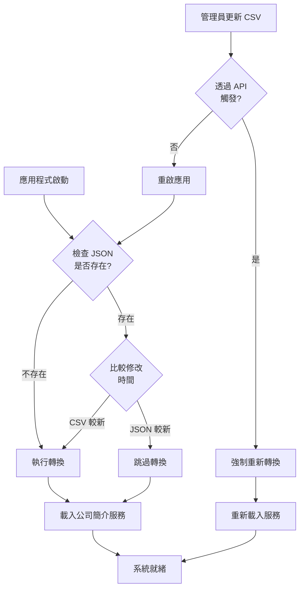

# 公司資料更新與轉換策略

**文檔目的**: 說明何時需要重新轉換公司資料，以及如何自動化這個流程

---

## 🎯 需要重新轉換的時機點

### 1. **資料來源更新時** 📝

當 `data/公司介紹.csv` 有任何變更時：

```
觸發情況：
├─ 公司資訊更新（地址、電話、官網）
├─ 新增服務項目
├─ 修改公司簡介內容
├─ 更新促銷活動資訊
├─ FAQ 內容調整
└─ 關鍵字優化
```

### 2. **系統啟動時** 🚀

應用程式啟動時自動檢查並轉換：

```python
# 在 app.py 啟動時
@app.on_event("startup")
async def startup_event():
    # 檢查 CSV 是否比 JSON 新
    if csv_is_newer_than_json():
        print("[INFO] 偵測到 CSV 更新，重新轉換...")
        convert_csv_to_json()
    
    # 載入公司簡介資料
    company_service.load_from_file()
```

### 3. **管理員手動觸發** 🔧

透過 Admin API 手動重新載入：

```bash
# 管理員透過 API 觸發
curl -X POST https://api.example.com/api/admin/reload-company-profile \
  -H "Authorization: Bearer ADMIN_TOKEN"
```

---

## 🔄 轉換策略比較

### 方案 A: **啟動時自動檢查** ⭐⭐⭐⭐⭐ (推薦)

```python
def should_convert() -> bool:
    """檢查是否需要重新轉換"""
    csv_path = Path("data/公司介紹.csv")
    json_path = Path("data/company_profiles/company_profile_chuanchi.jsonl")
    
    # 如果 JSON 不存在，需要轉換
    if not json_path.exists():
        return True
    
    # 如果 CSV 比 JSON 新，需要轉換
    csv_mtime = csv_path.stat().st_mtime
    json_mtime = json_path.stat().st_mtime
    
    return csv_mtime > json_mtime
```

**優點**:
- ✅ 自動化，無需手動干預
- ✅ 確保資料始終最新
- ✅ 開發和生產環境都適用

**缺點**:
- ⚠️ 啟動時間略增（< 0.1 秒）

---

### 方案 B: **檔案監聽自動轉換** ⭐⭐⭐⭐

使用檔案系統監聽器（watchdog）：

```python
from watchdog.observers import Observer
from watchdog.events import FileSystemEventHandler

class CSVChangeHandler(FileSystemEventHandler):
    def on_modified(self, event):
        if event.src_path.endswith('公司介紹.csv'):
            print("[INFO] 偵測到 CSV 變更，開始轉換...")
            convert_csv_to_json()
            
            # 通知服務重新載入
            company_service.reload()
```

**優點**:
- ✅ 即時反應，無需重啟
- ✅ 適合開發環境

**缺點**:
- ⚠️ 需要額外依賴（watchdog）
- ⚠️ 生產環境可能不適用

---

### 方案 C: **手動觸發 + Admin API** ⭐⭐⭐

管理員透過 API 手動觸發：

```python
@router.post("/api/admin/reload-company-profile")
async def reload_company_profile(token: str = Header(...)):
    if token != ADMIN_TOKEN:
        raise HTTPException(401, "Unauthorized")
    
    # 重新轉換
    convert_csv_to_json()
    
    # 重新載入
    company_service.reload()
    
    return {"status": "success", "message": "公司資料已重新載入"}
```

**優點**:
- ✅ 可控性高
- ✅ 適合低頻更新場景

**缺點**:
- ⚠️ 需要手動操作
- ⚠️ 可能忘記更新

---

## 🛠️ 建議實作方案

### **混合方案**: 方案 A + 方案 C ⭐⭐⭐⭐⭐

**開發環境**:
- 啟動時自動檢查並轉換
- 開發者修改 CSV 後重啟即可

**生產環境**:
- 啟動時自動檢查（防止遺漏）
- 提供 Admin API 手動觸發（緊急更新）

---

## 💻 實作代碼

### 1. **建立智能轉換模組**

建立 `backend/company_profile_loader.py`:

```python
"""
公司簡介智能載入器
自動檢查並轉換 CSV 到 JSON
"""
from pathlib import Path
import time
from typing import Optional
from etl.convert_company_csv_to_json import CompanyProfileConverter


class CompanyProfileLoader:
    """公司簡介智能載入器"""
    
    def __init__(
        self,
        csv_path: Path,
        json_path: Path,
        auto_convert: bool = True
    ):
        self.csv_path = csv_path
        self.json_path = json_path
        self.auto_convert = auto_convert
        self.last_check_time: Optional[float] = None
    
    def should_convert(self) -> bool:
        """檢查是否需要重新轉換"""
        # JSON 不存在，需要轉換
        if not self.json_path.exists():
            print(f"[INFO] JSON 檔案不存在，需要轉換")
            return True
        
        # CSV 不存在，無法轉換
        if not self.csv_path.exists():
            print(f"[WARNING] CSV 檔案不存在: {self.csv_path}")
            return False
        
        # 比較檔案修改時間
        csv_mtime = self.csv_path.stat().st_mtime
        json_mtime = self.json_path.stat().st_mtime
        
        if csv_mtime > json_mtime:
            csv_time = time.strftime('%Y-%m-%d %H:%M:%S', time.localtime(csv_mtime))
            json_time = time.strftime('%Y-%m-%d %H:%M:%S', time.localtime(json_mtime))
            print(f"[INFO] CSV 較新，需要轉換")
            print(f"  CSV 更新時間: {csv_time}")
            print(f"  JSON 更新時間: {json_time}")
            return True
        
        return False
    
    def convert_if_needed(self) -> bool:
        """如果需要，執行轉換"""
        if not self.auto_convert:
            return False
        
        if not self.should_convert():
            print(f"[INFO] 公司資料已是最新，無需轉換")
            return False
        
        print(f"[INFO] 開始轉換公司資料...")
        start = time.time()
        
        try:
            converter = CompanyProfileConverter(self.csv_path, self.json_path)
            converter.convert()
            
            elapsed = (time.time() - start) * 1000
            print(f"[SUCCESS] ✅ 轉換完成，耗時 {elapsed:.1f}ms")
            
            self.last_check_time = time.time()
            return True
            
        except Exception as e:
            print(f"[ERROR] ❌ 轉換失敗: {e}")
            import traceback
            traceback.print_exc()
            return False
    
    def force_convert(self) -> bool:
        """強制重新轉換（不檢查時間戳）"""
        print(f"[INFO] 強制重新轉換公司資料...")
        
        try:
            converter = CompanyProfileConverter(self.csv_path, self.json_path)
            converter.convert()
            
            print(f"[SUCCESS] ✅ 強制轉換完成")
            self.last_check_time = time.time()
            return True
            
        except Exception as e:
            print(f"[ERROR] ❌ 強制轉換失敗: {e}")
            return False


# 全域載入器實例
_loader: Optional[CompanyProfileLoader] = None


def get_loader() -> CompanyProfileLoader:
    """取得全域載入器實例"""
    global _loader
    
    if _loader is None:
        from pathlib import Path
        
        # 設定路徑
        base_path = Path(__file__).parent.parent
        csv_path = base_path / "data" / "公司介紹.csv"
        json_path = base_path / "data" / "company_profiles" / "company_profile_chuanchi.jsonl"
        
        _loader = CompanyProfileLoader(
            csv_path=csv_path,
            json_path=json_path,
            auto_convert=True
        )
    
    return _loader


def ensure_company_profile_ready() -> bool:
    """確保公司簡介資料已準備好"""
    loader = get_loader()
    return loader.convert_if_needed()
```

---

### 2. **整合到應用程式啟動**

修改 `backend/app.py`:

```python
from company_profile_loader import ensure_company_profile_ready

@app.on_event("startup")
async def startup_event():
    """應用程式啟動時執行"""
    print("=" * 60)
    print("🚀 SEARCH_Goods 啟動中...")
    print("=" * 60)
    
    # 1. 載入商品資料
    print("\n[1/3] 載入商品資料...")
    load_data()  # 現有的商品資料載入
    
    # 2. 檢查並轉換公司簡介（新增）
    print("\n[2/3] 檢查公司簡介資料...")
    if ensure_company_profile_ready():
        print("✅ 公司簡介資料已更新")
    else:
        print("✅ 公司簡介資料已就緒")
    
    # 3. 載入公司簡介服務
    print("\n[3/3] 初始化公司簡介服務...")
    from company_profile_service import get_company_profile_service
    service = get_company_profile_service()
    
    from pathlib import Path
    json_path = Path("data/company_profiles/company_profile_chuanchi.jsonl")
    service.load_from_file(json_path)
    
    print("\n" + "=" * 60)
    print("✅ 系統啟動完成！")
    print("=" * 60 + "\n")
```

---

### 3. **新增 Admin API 端點**

在 `backend/app.py` 新增：

```python
from company_profile_loader import get_loader
from fastapi import Header, HTTPException

@app.post("/api/admin/reload-company-profile")
async def reload_company_profile(
    authorization: str = Header(None),
    force: bool = False
):
    """
    重新載入公司簡介資料
    
    參數:
        authorization: Bearer token (必需)
        force: 是否強制重新轉換（預設 False）
    """
    # 驗證 token
    if not authorization or not authorization.startswith("Bearer "):
        raise HTTPException(401, "Missing or invalid authorization header")
    
    token = authorization.replace("Bearer ", "")
    
    from os import getenv
    admin_token = getenv("ADMIN_TOKEN")
    
    if token != admin_token:
        raise HTTPException(401, "Invalid admin token")
    
    # 執行轉換和重新載入
    loader = get_loader()
    
    if force:
        success = loader.force_convert()
    else:
        success = loader.convert_if_needed()
    
    if not success:
        raise HTTPException(500, "Failed to convert company profile")
    
    # 重新載入服務
    from company_profile_service import get_company_profile_service
    from pathlib import Path
    
    service = get_company_profile_service()
    json_path = Path("data/company_profiles/company_profile_chuanchi.jsonl")
    service.load_from_file(json_path)
    
    return {
        "status": "success",
        "message": "公司簡介資料已重新載入",
        "forced": force,
        "timestamp": time.time()
    }
```

---

## 📋 使用方式

### **開發環境**

```bash
# 1. 修改 CSV 檔案
vim data/公司介紹.csv

# 2. 重啟應用程式（自動轉換）
cd backend
uvicorn app:app --reload

# 輸出:
# [2/3] 檢查公司簡介資料...
# [INFO] CSV 較新，需要轉換
#   CSV 更新時間: 2025-11-09 14:30:00
#   JSON 更新時間: 2025-11-09 10:00:00
# [INFO] 開始轉換公司資料...
# [SUCCESS] ✅ 轉換完成，耗時 85.3ms
```

---

### **生產環境**

#### 方式 1: 透過 Admin API

```bash
# 重新載入（只在需要時轉換）
curl -X POST https://your-api.com/api/admin/reload-company-profile \
  -H "Authorization: Bearer YOUR_ADMIN_TOKEN"

# 強制重新轉換
curl -X POST "https://your-api.com/api/admin/reload-company-profile?force=true" \
  -H "Authorization: Bearer YOUR_ADMIN_TOKEN"
```

#### 方式 2: 重啟應用程式

```bash
# 在 Render 或其他平台重新部署
# 應用程式啟動時會自動檢查並轉換
```

---

## 🔔 監控和通知

### 建議加入日誌記錄

```python
import logging

logger = logging.getLogger(__name__)

def convert_if_needed(self) -> bool:
    if not self.should_convert():
        logger.info("公司資料已是最新")
        return False
    
    logger.warning("偵測到公司資料更新，開始轉換...")
    
    try:
        converter = CompanyProfileConverter(self.csv_path, self.json_path)
        converter.convert()
        
        logger.info("✅ 公司資料轉換成功")
        
        # 可選：發送通知
        # send_slack_notification("公司資料已更新")
        
        return True
    except Exception as e:
        logger.error(f"❌ 公司資料轉換失敗: {e}")
        
        # 可選：發送告警
        # send_alert_notification(f"公司資料轉換失敗: {e}")
        
        return False
```

---

## 📊 轉換流程圖



---

## ✅ 總結建議

### 🎯 **推薦做法**

1. **啟動時自動檢查** ⭐⭐⭐⭐⭐
   - 在 `app.py` 的 `startup_event` 中加入檢查
   - 比較 CSV 和 JSON 的修改時間
   - 自動轉換（如果需要）

2. **提供 Admin API** ⭐⭐⭐⭐
   - 支援手動觸發重新載入
   - 支援強制轉換選項
   - 需要管理員權限

3. **日誌和監控** ⭐⭐⭐
   - 記錄每次轉換的時間和結果
   - 轉換失敗時發送告警
   - 可選：整合 Slack/Email 通知

### 🚫 **不推薦做法**

- ❌ 手動轉換後手動複製檔案（容易出錯）
- ❌ 完全依賴手動操作（容易遺忘）
- ❌ 沒有任何自動化機制

---

## 📝 檢查清單

更新公司資料時：

- [ ] 修改 `data/公司介紹.csv`
- [ ] 開發環境：重啟應用（自動轉換）
- [ ] 生產環境：
  - [ ] 選項 1: 透過 Admin API 觸發
  - [ ] 選項 2: 重新部署（自動轉換）
- [ ] 驗證轉換結果
- [ ] 測試查詢功能

---

**文檔更新**: 2025年11月9日  
**建議實作優先級**: Phase 2（在建立 CompanyProfileService 後）

