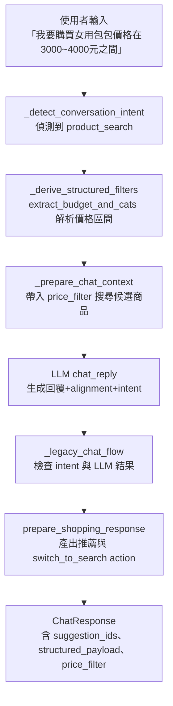

# 女用包包 3000~4000 元查詢流程圖說明

## 使用情境
- 用戶輸入：「我要購買女用包包價格在 3000~4000 元之間」
- 目標：確認系統從意圖判斷、價格抽取、到推薦輸出整體流程

## 主要模組
1. `backend/llm_service.py:_detect_conversation_intent`  
   - 捕捉 `我要買`、`價格` 等購買意圖關鍵字，將對話切換到 `product_search` 模式。
2. `backend/llm_service.py:_derive_structured_filters`  
   - 呼叫 `utils.simple_extract.extract_budget_and_cats`，解析「3000~4000 元」並產生 `price_filter={"min_price":3000,"max_price":4000}`。
3. `backend/llm_service.py:_prepare_chat_context`  
   - 帶入 `structured_filters` 搜尋商品、組裝 `context["products"]` 與結構化資訊。
4. `backend/chat_router_goods_action.py:_legacy_chat_flow`  
   - 接收 LLM 回傳的 `intent="product_search"`、`structured_filters`、`alignment`，決定進入購物導購模式。
5. `backend/modes/shopping_recommender.py:prepare_shopping_response`  
   - 整合 LLM alignment／Planner，建立 `switch_to_search` action、`structured_payload`、`suggestion_ids`。

## Mermaid 流程圖

## 節點說明
- **B**：使用 `PURCHASE_INTENT_PATTERNS`（`backend/llm_service.py:308-314`）判斷購買流程。
- **C**：`utils/simple_extract.py:37-108` 透過波浪號正則式抽出上下限，確保 `min_price=3000`、`max_price=4000`。
- **D**：`_search_products_for_chat` 帶著 price filter 篩選候選商品，確保搜尋結果對應女包與價格區間。
- **E**：`chat_reply` 產出 `intent="product_search"`、`alignment.items=[GoodIden…]`，為後續導購準備資料。
- **F**：`_legacy_chat_flow` 看到 `intent="product_search"` 時，改用購物流程而非資訊回覆。
- **G**：`prepare_shopping_response` 決定是否觸發 Planner，並將建議商品編號包成 `switch_to_search` action。
- **H**：最終 `ChatResponse` 包含 `structured_filters.price_filter`、建議商品清單與 session 快取。

## 測試驗證
- `python3 -m pytest backend/tests/test_chat_search_results.py::test_prepare_chat_context_returns_multiple_results -q`
  - 透過此測試確認 `structured_filters.price_filter` 正確等於 `[3000, 4000]`，並確保有候選商品或結構化過濾資訊。

## 使用建議
- 若要追蹤其他價格範圍情境，可重複此流程並著重於 `_derive_structured_filters` 與 `prepare_shopping_response` 的輸出。

