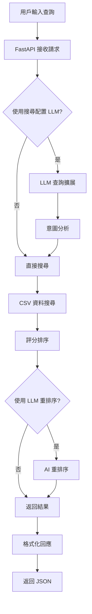
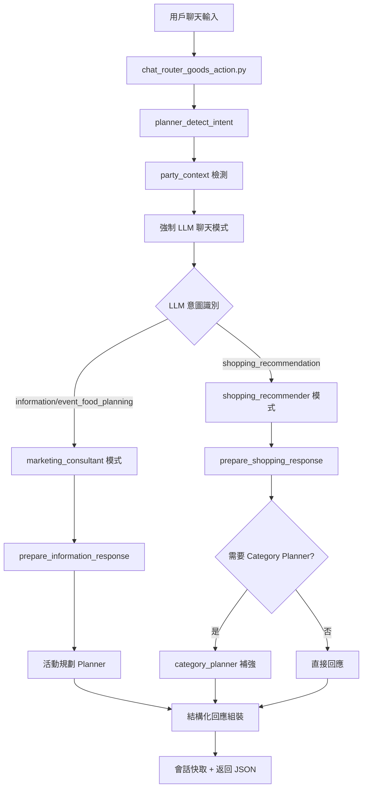
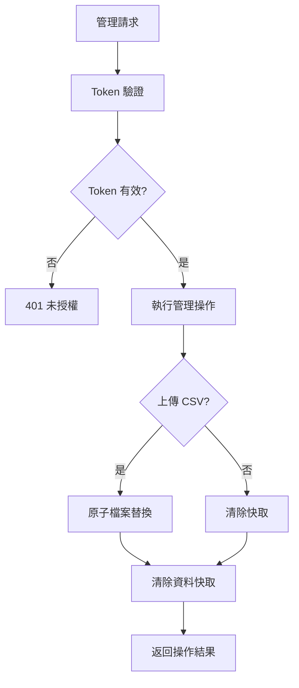

# SEARCH_Goods 系統資訊流程文檔

## 系統架構總覽

### 技術棧
- **後端框架**: FastAPI 0.115.0
- **ASGI 伺服器**: Uvicorn 0.30.6
- **AI 服務**: OpenAI GPT-4o-mini
- **資料處理**: Pandas 2.2.2
- **前端**: 純 HTML/CSS/JavaScript SPA
- **資料格式**: CSV (VIEW_GOODS_enhanced.csv)

## 主要服務模組 - **實際架構**

### 1. FastAPI 應用核心 (`backend/app.py`)
```
功能職責:
├── API 路由管理
├── CORS 中介軟體  
├── 檔案上傳處理
├── 健康檢查端點
├── SPA 靜態檔案服務
├── 管理端點認證
├── 聊天路由整合 (chat_router_goods_action)
└── 會話快取管理 (CHAT_SESSION_CACHE, SUGGEST_CACHE)
```

### 2. 聊天路由控制器 (`backend/chat_router_goods_action.py`) - **核心模組**
```
聊天流程管理:
├── chat_handler(): 主聊天處理器
├── simple_chat_handler(): 簡化版處理器
├── _invoke_category_planner(): Planner 調用
├── _merge_planner_reply(): 回覆合併
├── 意圖檢測與路由分流
├── 多層容錯機制 (LLM→Fallback→Enhanced Mock→Simple)
├── `_finalize_directional_products()`：搜尋 fallback 命中商品時輸出卡片結構
├── `_finalize_text_only_fallback()`：僅提供方向建議時清空商品資料
└── 會話狀態管理與快取同步
```

### 3. 商品搜尋服務 (`backend/goods_search_service.py`)
```
核心功能:
├── CSV 資料載入與快取
├── 商品搜尋演算法
├── 評分機制 (名稱匹配+2分, 描述+1分, 類別+1分)
├── 結果格式化
├── 推薦系統 (原始商品、特價、互補)
└── 目錄快照管理 (get_catalog_snapshot)
```

### 4. LLM 服務 (`backend/llm_service.py`) - **配置分離**
```
AI 功能模組 (搜尋 vs 聊天配置):
├── 查詢擴展 (llm_expand_query) - 可分離配置
├── 意圖分析 (llm_analyze_query) - 可分離配置  
├── 短描述生成 (llm_shorten_20) - 可分離配置
├── 宣傳文案生成 (llm_generate_promo) - 可分離配置
├── 結果重排序 (llm_rerank_products) - 可分離配置
├── 聊天回覆 (chat_reply) - 強制啟用模式
├── 商品格式化 (format_product_recommendations) - 新功能
└── 配置管理 (SEARCH_* vs CHAT_* 環境變數)
```

### 5. 聊天模式管理 (`backend/modes/`) - **新架構**
```
模式分離系統:
├── marketing_consultant.py
│   ├── prepare_information_response()
│   ├── 活動建議與資訊導購
│   └── Event Food Planner 整合
├── shopping_recommender.py  
│   ├── prepare_shopping_response()
│   ├── 商品推薦與購物導購
│   └── Category Planner 整合
└── __init__.py (統一匯出)
```

### 6. 規劃器系統 (`backend/planner/`) - **新架構**
```
智能規劃模組:
├── category_planner.py
│   ├── DetectedIntent 意圖偵測
│   ├── build_plan() 品類規劃
│   ├── 預算分配演算法
│   └── 通用購物情境處理
├── event_food_planner.py
│   ├── EventContext 活動上下文
│   ├── generate_event_plan() 活動規劃
│   └── 專門活動情境處理
└── __init__.py (統一匯出)
```

### 7. 回退系統 (`backend/fallback/`) - **保留機制** 
```
容錯處理:
├── multi_category_party.py
│   ├── run_fallback() 生日派對處理
│   ├── need_fallback() 情境偵測
│   ├── 智能預算分配
│   └── 複雜場景後備機制
└── 與新 Planner 系統並存
```

### 8. 配置管理 (`backend/config_store.py`)
```
動態配置:
├── 品牌設定管理
├── YouTube 連結  
├── Logo 設定
├── 系統提示詞
└── JSON 檔案持久化
```

## 資訊流程圖

### A. 搜尋 API 流程 (`/api/search`)



**詳細步驟:**
1. **請求接收**: FastAPI 驗證請求格式
2. **LLM 預處理** (可選):
   - 查詢擴展: 將簡短查詢擴展為更詳細的搜尋詞
   - 意圖分析: 解析必需詞彙、排除詞彙、價格範圍
3. **資料搜尋**:
   - 從 CSV 快取中搜尋匹配商品
   - 應用評分演算法 (最低門檻 1.5 分)
4. **結果後處理**:
   - LLM 重排序 (可選)
   - 生成短描述 (可選)
   - 產生宣傳文案 (可選)

### B. 聊天 API 流程 (`/api/chat`) - **實際架構**



**實際聊天架構特色:**
1. **分層處理機制**:
   - **Intent Detection**: `planner_detect_intent()` 預先分析需求
   - **Party Context**: `need_fallback()` 檢測特殊情境
   - **LLM 主導**: `chat_reply()` 強制透過 AI 互動
   
2. **雙模式路由** (`modes/`):
   - **Marketing Consultant**: 活動建議、資訊諮詢 (`prepare_information_response`)
   - **Shopping Recommender**: 商品推薦、購物導購 (`prepare_shopping_response`)
   
3. **三層 Planner 系統**:
   - **Event Food Planner**: 活動情境的商品組合規劃
   - **Category Planner**: 通用品類規劃與預算分配  
   - **Multi-Category Fallback**: 生日派對等複雜場景後備機制

4. **容錯回退鏈與回傳格式對應**:
   ```
   LLM Chat → Fallback System → Enhanced Mock → Simple Handler
   ```
   - **搜尋 fallback (命中商品)**：由 `_finalize_directional_products()` 組裝，保留 `suggestion_ids`/`items`，`meta.directional_products = true`
   - **純文字 fallback**：由 `_finalize_text_only_fallback()` 組裝，清除卡片資料並標記 `meta.search_fallback = true`
   - **前端行為約定**：
     1. `directional_products = true` 時允許渲染右側卡片並更新快取。
     2. `search_fallback = true` 時僅顯示狀態訊息並清除舊快取，避免按 1 播放舊商品。

### C. 管理 API 流程 (`/api/admin/*`)



## 資料流向

### 1. CSV 資料管理
```
VIEW_GOODS_enhanced.csv
├── 載入: pandas.read_csv()
├── 快取: 全域 _df_cache 變數
├── 更新: 原子檔案替換 (os.replace)
├── 欄位映射: column_definitions.json
└── 清除: /api/admin/clear-cache
```

### 2. LLM 配置分離機制 - **實際實作**
```
搜尋配置 (SEARCH_* 環境變數):
├── SEARCH_USE_LLM_EXPAND (預設 False)
├── SEARCH_USE_LLM_INTENT (預設 False) 
├── SEARCH_USE_LLM_RERANK (預設 False)
├── SEARCH_USE_LLM_SHORTDESC (預設 False)
├── SEARCH_USE_LLM_PROMO (預設 False)
├── SEARCH_OPENAI_MODEL (預設 gpt-4o-mini)
└── 用於 /api/search 端點

聊天配置 (CHAT_* 環境變數):
├── CHAT_USE_LLM_EXPAND (強制 True)
├── CHAT_USE_LLM_INTENT (強制 True)
├── CHAT_USE_LLM_RERANK (預設 False)
├── CHAT_USE_LLM_SHORTDESC (強制 True)  
├── CHAT_USE_LLM_PROMO (強制 True)
├── CHAT_OPENAI_MODEL (預設 gpt-4o-mini)
└── 用於 /api/chat 端點 (強制啟用 LLM 互動)

向後相容 (USE_* 環境變數):
├── USE_LLM_EXPAND → SEARCH_USE_LLM_EXPAND
├── USE_LLM_INTENT → SEARCH_USE_LLM_INTENT
├── OPENAI_MODEL → SEARCH_OPENAI_MODEL
└── 保持既有系統正常運作
```

### 3. 會話管理
```
記憶體快取系統:
├── SESSION_ALIGN_CACHE: 商品對齊確認
├── SUGGEST_CACHE: 推薦狀態
├── TTL 機制: 自動過期清理
└── _cleanup_session_cache(): 記憶體管理
```

## 商品評分演算法

### 評分規則
```python
評分權重:
├── 商品名稱匹配: +2.0 分
├── 描述內容匹配: +1.0 分  
├── 類別/備註匹配: +1.0 分
├── 特價商品加分: +0.2 分
└── 最低門檻: 1.5 分
```

### 搜尋優化
1. **關鍵詞正規化**: 移除特殊符號
2. **多欄位搜尋**: 名稱、描述、類別、備註
3. **模糊匹配**: 支援部分詞彙匹配
4. **結果限制**: 可配置返回數量 (topn)

## 商品格式化系統

### 自動偵測與轉換
```python
偵測模式:
├── 正規表達式模式匹配
├── 商品資料庫查找驗證
├── 格式化文字生成
└── JSON 結構化記錄

輸出格式:
├── 標準顯示: 🛍️ [商品名稱] - 價格元 (查看商品)
├── 結構化資料: structured_products JSON 欄位
└── API 回應整合
```

## 錯誤處理與容錯

### 多層容錯設計
1. **LLM 服務容錯**:
   - OpenAI API 失敗時使用基本搜尋
   - 網路超時處理
   - 配額超限回退
2. **資料載入容錯**:
   - CSV 格式錯誤處理
   - 缺失欄位補充
   - 資料型態轉換
3. **會話狀態容錯**:
   - 記憶體快取過期處理
   - 會話清理機制

## 部署架構 - **實際配置**

### 生產環境
```
前端 (Netlify):
├── 靜態 HTML/CSS/JS (frontend/index.html)
├── CDN 全球分發
└── 自動部署 (GitHub Actions)

後端 (Render):
├── FastAPI + Gunicorn (gunicorn_conf.py)
├── 環境變數配置 (LLM 分離設定)
├── 健康檢查端點 (GET /health)
├── 自動部署 (GitHub Actions)
└── 關鍵環境變數:
    ├── USE_CHAT_MODE=True (啟用聊天模式)
    ├── CHAT_USE_LLM_EXPAND=True (強制 LLM)
    ├── OPENAI_API_KEY (必須設定)
    ├── ADMIN_TOKEN (管理端點保護)
    └── DATA_PATH (CSV 檔案路徑)
```

### 開發環境
```
本地開發:
├── Docker Compose 支援 (docker-compose.dev.yml)
├── 熱重載 (uvicorn --reload)
├── 開發者管理端點 (ALLOW_DEV_ADMIN=1)
├── 測試套件 (pytest)
│   ├── test_category_planner.py (新 Planner 測試)
│   ├── test_event_intent.py (意圖識別測試)
│   ├── test_product_formatting.py (格式化測試) 
│   └── 既有測試保持兼容
└── 調試工具:
    ├── debug_birthday.py (聊天流程調試)
    └── 多個測試腳本 (test_*.py)
```

## 監控與維運

### 健康檢查
- **端點**: `GET /health`
- **檢查項目**: API 可用性、基本功能
- **回應**: 簡單狀態碼

### 日誌記錄
- **應用層**: FastAPI 存取日誌
- **LLM 服務**: OpenAI API 呼叫記錄
- **錯誤處理**: 異常堆疊追蹤

### 效能指標
- **搜尋延遲**: 基本搜尋 <100ms, LLM 增強 <3s
- **記憶體使用**: CSV 快取 + 會話快取
- **併發處理**: Uvicorn 多 worker 支援

## 安全性考量

### API 安全
- **CORS 配置**: 跨域請求控制
- **管理端點**: Token 認證保護
- **檔案上傳**: 類型驗證與大小限制

### 資料安全
- **環境變數**: 敏感配置分離
- **API 金鑰**: OpenAI 憑證管理
- **檔案存取**: 受限路徑存取

## 未來擴展方向 - **基於現有架構**

### 技術改進
1. **資料庫整合**: 從 CSV 遷移至關聯式資料庫
   - 保持 FieldAccessor 抽象層兼容
   - 漸進式遷移策略
2. **快取系統**: Redis 替代記憶體快取
   - 替換 CHAT_SESSION_CACHE 和 SUGGEST_CACHE
   - 支援分散式部署
3. **搜尋引擎**: Elasticsearch 整合
   - 增強商品搜尋能力
   - 保持現有評分演算法
4. **API 文檔**: OpenAPI/Swagger 完整文檔
   - ChatResponse 模型已定義完成
   - 補充完整 API 規格

### 架構優化 (基於已實作的模組化設計)
1. **模式擴展** (`modes/`):
   - 新增 `price_comparison.py` (價格比較模式)
   - 新增 `product_discovery.py` (商品探索模式)
   - 新增 `seasonal_recommendation.py` (季節推薦模式)

2. **Planner 擴展** (`planner/`):
   - 新增 `budget_optimizer.py` (預算最佳化)
   - 新增 `nutrition_planner.py` (營養規劃)
   - 新增 `gift_planner.py` (禮品規劃)

3. **LLM 功能增強** (`llm_service.py`):
   - 多語言支援 (保持配置分離)
   - 個人化學習機制
   - 情境記憶功能

### 功能增強
1. **用戶系統**: 登入、個人化推薦
   - 整合現有會話管理機制
   - 擴展 SUGGEST_CACHE 為用戶快取
2. **購物車**: 商品收藏與比較
   - 基於現有 structured_payload 格式
   - 整合 suggestion_ids 機制
3. **即時通知**: WebSocket 即時更新
   - 擴展現有聊天架構
   - 保持 API 兼容性
4. **多語言**: 國際化支援
   - 利用 LLM 配置分離機制
   - 保持現有 column_definitions.json 映射

## 關鍵實作差異說明

### 📋 任務規劃 vs 實際實作
基於 `docs/chat_flow_refactor_tasks.md` 的規劃，目前實作狀況如下：

#### ✅ **已完成**:
1. **模組化架構**: `modes/` 和 `planner/` 已建立完成
2. **LLM 主導流程**: `chat_handler` 強制透過 LLM 互動 
3. **配置分離**: SEARCH_* vs CHAT_* 環境變數已實作
4. **意圖識別**: `planner_detect_intent()` 和路由分流已完成
5. **容錯機制**: 多層回退系統 (LLM→Fallback→Enhanced Mock→Simple) 已建立

#### 🚧 **部分完成**:
1. **Event Food Planner**: 模組存在但整合程度待確認
2. **對話追問機制**: 基礎架構完成，詳細流程待優化
3. **測試覆蓋**: 部分測試檔案已建立，完整性待評估

#### 📝 **待實作** (優先順序):
1. **Intent 擴充**: `event_food_planning` 完全整合
2. **追問模板系統**: 標準化資訊收集流程  
3. **急迫性處理**: 對話輪數控制與快速模式
4. **完整測試覆蓋**: CI/CD 整合測試

### 🔍 **技術債務**:
1. **代碼重複**: `fallback/multi_category_party.py` 與新 Planner 系統並存
2. **配置複雜性**: 多套環境變數系統並存 (向後相容)
3. **異常處理**: 多層 try-catch 可能掩蓋實際問題

### 🎯 **下階段重點**:
1. 統一 Planner 系統，逐步移除 Fallback 重複邏輯
2. 完善意圖識別準確度與對話流程控制
3. 建立完整的監控與日誌機制
4. 優化 LLM Token 使用效率

---

**文檔版本**: v2.0 (基於實際程式碼分析)  
**最後更新**: 2025年10月31日  
**程式碼檢查日期**: 2025年10月31日  
**維護責任**: 系統開發團隊  
**參考文檔**: `docs/chat_flow_refactor_tasks.md`, `CONFIGURATION_SEPARATION.md`
