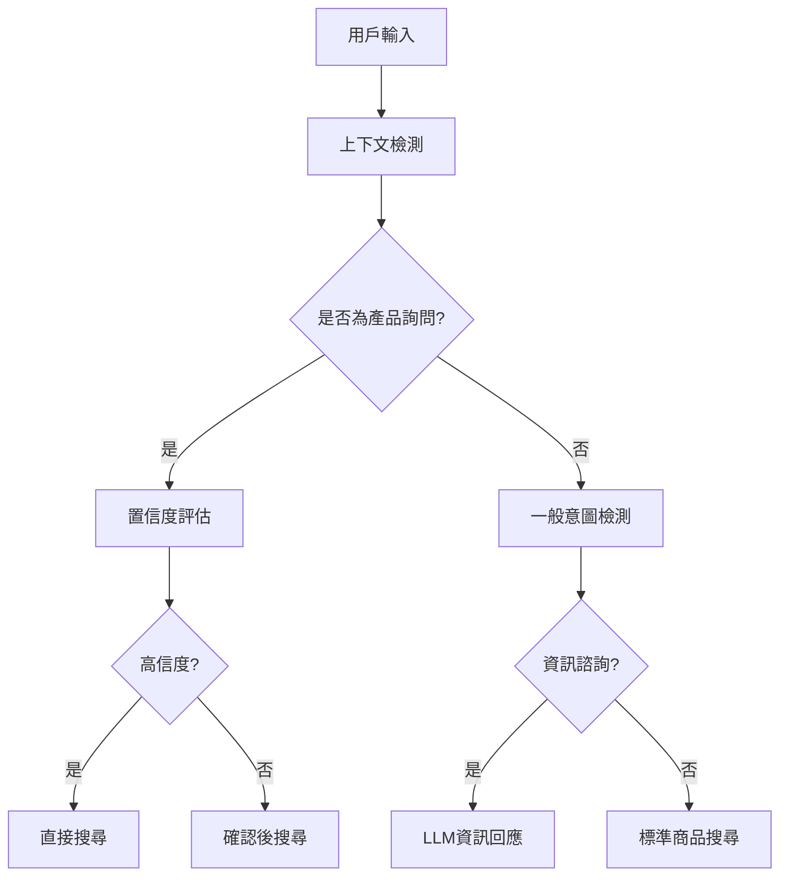
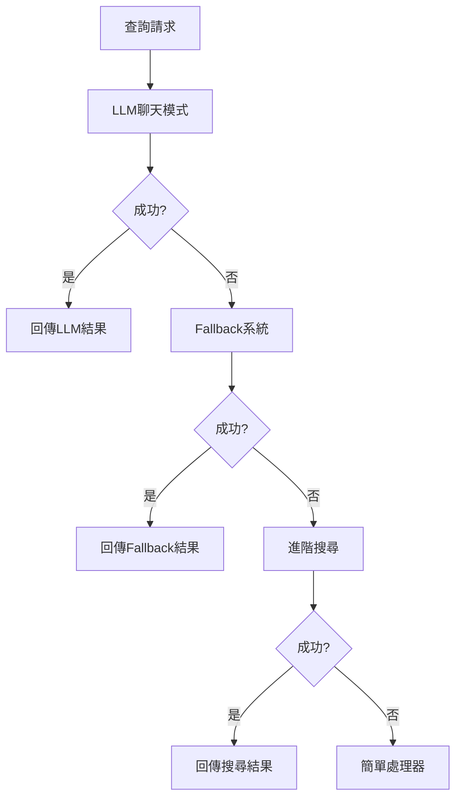

# SEARCH_Goods 聊天對話及商品查詢系統設計規格書

## 🏗️ 系統架構概覽

### 核心組件架構
```
Frontend (SPA) ← API → Backend Services → Data Layer
    ↓                    ↓                    ↓
index.html         FastAPI Routes        CSV Database
                      ↓
            chat_router_goods_action.py
                      ↓
               llm_service.py
                      ↓
            goods_search_service.py
```

## 📋 1. 聊天對話系統規格 (`llm_service.py`)

### 1.1 核心功能模組

#### A. 意圖檢測系統
```python
# 三層意圖分析架構
1. 上下文產品詢問檢測 (_detect_context_product_inquiry)
   - 高信度觸發詞: "購買這個", "買這個", "要這個", "訂購這個"
   - 中信度觸發詞: "有賣這個嗎", "你有這個嗎"
   - 置信度算法: 0.9 (direct_search) | 0.6 (confirm_search)

2. 一般對話意圖檢測 (_detect_conversation_intent)
   - information: 健康諮詢、使用方法、產品知識
   - product_search: 明確購買意圖
   - general: 一般對話

3. 子意圖分類 (_detect_intent_subtype)
   - health, usage, knowledge, comparison, recommendation
```

#### B. 上下文感知處理
```python
# 混合智慧上下文提取
def _extract_full_product_context(content, matched_keywords):
    # 核心產品關鍵詞庫 (CORE_PRODUCT_KEYWORDS)
    # 完整產品描述提取算法
    # 前後文字合併邏輯
```

#### C. LLM 整合系統
```python
# 雙模式 LLM 配置
SEARCH_* 系列: 商品搜尋相關 LLM 設定
CHAT_* 系列: 聊天對話相關 LLM 設定

# 動態客戶端管理
_get_client() -> 支援執行時 API key 更新
```

### 1.2 聊天流程設計

#### 對話處理流程圖
```
用戶輸入 → 上下文檢測 → 意圖分析 → 回應生成
    ↓            ↓           ↓         ↓
歷史分析 → 產品匹配 → 行動決策 → 結構化回應
```

#### 核心處理邏輯 (`chat_reply`)
```python
def chat_reply(user_message, history, catalog, topn=8):
    # 1. 上下文產品詢問檢測 (最高優先級)
    context_inquiry = _detect_context_product_inquiry(message, history)
    if context_inquiry:
        if confidence >= 0.8:  # 直接搜尋
            return direct_search_result
        else:  # 確認後搜尋
            return confirmation_request
    
    # 2. 資訊諮詢處理
    intent = _detect_conversation_intent(message)
    if intent == "information":
        return information_response_with_products
    
    # 3. 一般商品查詢
    return standard_product_search
```

### 1.3 個性化回應系統
```python
# 意圖驅動的系統提示詞
_build_information_system_prompt(intent_type):
    - health: 專業健康顧問語調
    - usage: 實用導向親切語調  
    - knowledge: 教育性易懂語調
    - comparison: 客觀專業分析
    - recommendation: 親切諮詢語調
```

## 📋 2. 商品查詢系統規格 (`chat_router_goods_action.py`)

### 2.1 查詢處理架構

#### 多層次查詢系統
```python
# 查詢優先級序列
1. LLM 聊天模式 (llm_service.chat_reply)
   - 上下文感知產品查詢
   - 資訊諮詢 + 產品推薦
   - 智慧對話式搜尋

2. Fallback 系統 (run_fallback)
   - 特殊情境處理 (生日聚會等)
   - 規則式商品組合推薦

3. 進階搜尋 (search_products_strict)
   - 結構化篩選器
   - 精確匹配算法

4. 簡單處理器 (simple_chat_handler)
   - 基本關鍵字匹配
   - 固定商品推薦
```

### 2.2 商品資料處理

#### 結構化商品資訊建構
```python
def _build_structured_items(items):
    # 商品資訊標準化
    - 商品編號 (GoodIden)
    - 商品名稱 (Name) 
    - 行銷描述 (_build_marketing_description)
    - 價格資訊 (Price + SpecialOffer)
    - 購物連結 (Goods_Link1)
    - 商品圖片 (Goodspic_Link1)
```

#### 行銷文案生成系統
```python
def _build_marketing_description(item):
    # 智慧行銷描述生成
    1. 核心名稱提取 (去規格、括號)
    2. 特色標籤匹配 (有機、全穀、高纖等)
    3. 情境式結尾 (MARKETING_TAILS)
    4. 長度控制 (≤30字)
```

### 2.3 會話狀態管理

#### 快取系統設計
```python
# 雙層快取架構
CHAT_SESSION_CACHE: 聊天會話結果 (TTL: 5分鐘)
SUGGEST_CACHE: 商品推薦對齊 (同步到 app.py)

# 快取清理策略
_cleanup_session_cache() → 過期會話自動清理
```

## 📋 3. 前端互動系統規格 (`index.html`)

### 3.1 用戶介面架構

#### 響應式佈局設計
```html
<!-- 主要區域劃分 -->
.workspace: CSS Grid (360px sidebar + 1fr main)
  ├── .sidebar: 搜尋面板 + 聊天面板
  └── .results-column: 商品展示區

<!-- 聊天介面組件 -->
.chat-box: 520px 高度對話框
.bubble.user / .bubble.assistant: 對話氣泡
.suggest-actions: 快速操作按鈕
```

#### 互動狀態管理
```javascript
# 模式切換系統
- chat-mode: 聊天主導模式
- search-mode: 搜尋結果展示
- .back-to-chat: 返回聊天按鈕

# 建議操作整合
1=原建議、2=特價關聯、3=智慧搭配
```

### 3.2 商品展示系統

#### 卡片式商品展示
```css
.card: 商品卡片容器
  ├── .card-image: 1:1 比例商品圖片
  ├── .card-body: 商品資訊區域
  └── .link-btn: 購買連結按鈕

# 視覺增強效果
- hover 動畫 (translateY + box-shadow)
- 漸層遮罩 (card-image::after)
- 價格突出顯示 (.price, .sale)
```

## 📋 4. API 端點規格

### 4.1 聊天 API
```python
@router.post("/api/chat")
def chat_handler(req: ChatReq) -> ChatResponse:
    # 輸入: message, history, topn, session_id
    # 輸出: reply, suggestion_ids, action, alignment
```

### 4.2 回應資料結構
```python
ChatResponse:
    reply: str                    # 聊天回應文字
    suggestion_ids: List[str]     # 推薦商品ID列表  
    action: Dict                  # 前端行動指令
    alignment: Dict               # 商品對齊資訊
    structured_payload: Dict      # 結構化商品資料
    session_id: str              # 會話追蹤ID
```

## 📋 5. 核心設計模式

### 5.1 意圖驅動架構
- **上下文感知**: 從對話歷史提取產品意圖
- **置信度分級**: 高信度直接執行，中信度確認後執行
- **個性化回應**: 意圖子類型決定語調風格

### 5.2 漸進式降級策略
- **LLM優先**: 智慧對話 → 規則後備 → 基本搜尋
- **優雅降級**: 複雜查詢失敗時自動使用簡單方法
- **結果對齊**: 不同系統結果統一格式化

### 5.3 會話狀態一致性
- **雙向同步**: 聊天快取與商品推薦快取同步
- **狀態持久**: 會話ID追蹤用戶互動脈絡
- **自動清理**: TTL機制防止記憶體洩漏

## 🎯 6. 效能與可擴展性

### 6.1 效能優化策略
- **快取分層**: 會話快取 + 商品快取
- **懶載入**: 商品詳細資料按需載入
- **批次處理**: 多商品查詢一次處理

### 6.2 擴展性設計
- **模組化**: LLM服務、搜尋服務、路由分離
- **配置驅動**: 環境變數控制功能開關
- **API版本化**: 向後相容的API設計

## 🔧 7. 技術實現細節

### 7.1 上下文產品詢問檢測演算法
```python
def _detect_context_product_inquiry(user_message, history):
    """
    🎯 混合智慧上下文產品詢問檢測器
    
    核心邏輯:
    1. 檢測置信度 (高/中信度觸發詞匹配)
    2. 提取上下文內容 (最近4輪對話)
    3. 匹配產品關鍵詞 (CORE_PRODUCT_KEYWORDS)
    4. 提取完整產品描述 (_extract_full_product_context)
    5. 根據置信度決策 (direct_search vs confirm_search)
    """
```

### 7.2 完整產品上下文提取
```python
def _extract_full_product_context(content, matched_keywords):
    """
    從對話內容中提取完整產品描述
    
    策略:
    - 向前尋找: 形容詞、品牌、製程描述
    - 向後尋找: 產品後綴詞 (油、粉、片、粒等)
    - 長度控制: 避免過長描述 (≤20字)
    - 合理性檢查: 選擇最佳匹配結果
    """
```

### 7.3 LLM 客戶端動態管理
```python
def _get_client():
    """
    動態 OpenAI 客戶端獲取
    
    特色:
    - 執行時 API key 更新支援
    - Debug 資訊記錄 (遮罩敏感資料)
    - 異常處理與降級策略
    """
```

## 📊 8. 資料流程圖

### 8.1 聊天對話流程


### 8.2 商品查詢處理流程


## 🧩 9. 模組依賴關係

### 9.1 後端模組依賴
```
app.py (主應用)
├── chat_router_goods_action.py (聊天路由)
│   ├── llm_service.py (LLM服務)
│   │   └── goods_search_service.py (商品搜尋)
│   └── fallback/multi_category_party.py (後備系統)
├── goods_search_service.py (搜尋服務)
└── config_store.py (配置管理)
```

### 9.2 前端組件架構
```
index.html (SPA)
├── 搜尋面板 (Search Panel)
├── 聊天面板 (Chat Panel)
├── 商品展示區 (Results Area)
└── 互動控制 (UI Controls)
```

---

> **文件版本**: v1.0  
> **最後更新**: 2025年10月29日  
> **維護者**: SEARCH_Goods 開發團隊