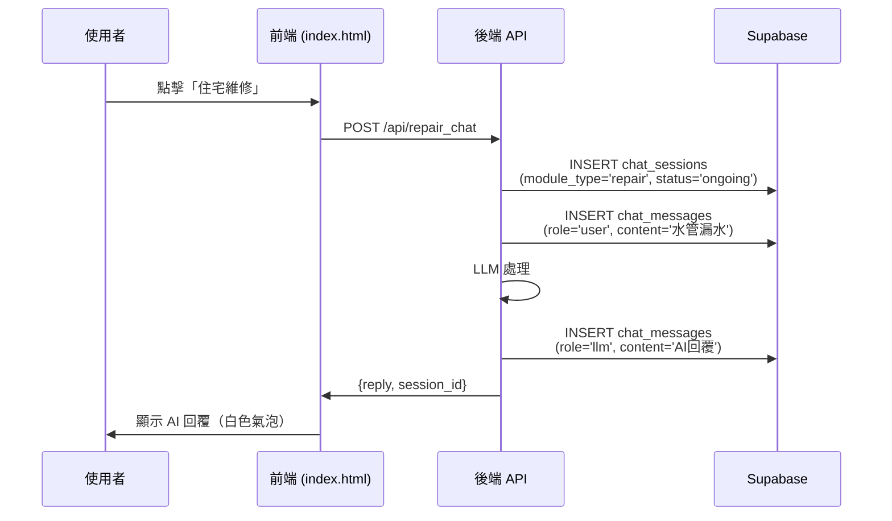
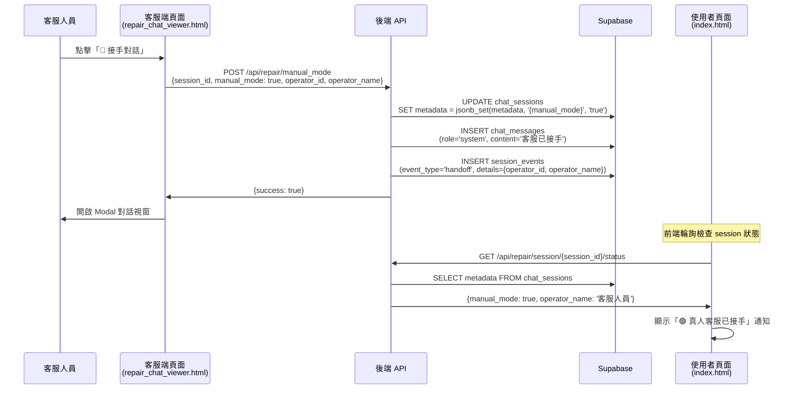
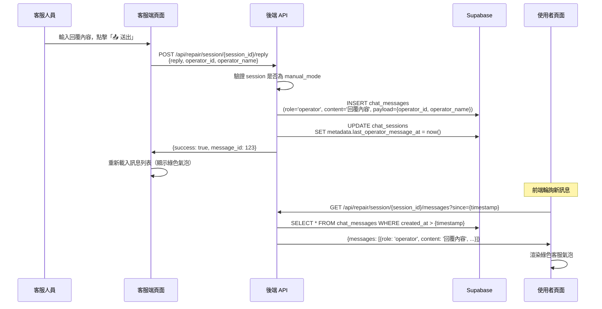
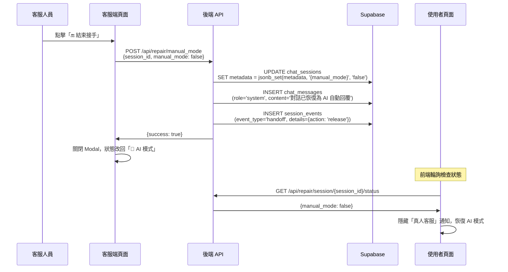

# 客服人工接手系統 - 資料控制流程設計

**建立日期：** 2025年11月25日  
**專案：** SEARCH_Goods - 住宅維修客服系統  
**目標：** 定義人工接手功能的完整資料流、狀態管理與 API 設計

---

## 📊 資料庫架構（基於 Supabase）

### 1. 現有資料表

根據 `docs/系統開發/聊天紀錄資料表設計.md`，系統已有以下資料表：

#### `chat_sessions` - 對話會話表
```sql
chat_sessions (
    session_id         uuid primary key,
    module_type        module_type not null,          -- 'repair' for 住宅維修
    user_id            text,
    company_code       text,
    company_name       text,
    status             chat_status default 'ongoing', -- 'ongoing', 'resolved', 'escalated', 'expired'
    started_at         timestamptz default now(),
    ended_at           timestamptz,
    channel            text,
    context_tags       text[],
    metadata           jsonb default '{}'
)
```

#### `chat_messages` - 訊息記錄表
```sql
chat_messages (
    message_id         bigserial primary key,
    session_id         uuid references chat_sessions(session_id),
    role               message_role not null,         -- 'user', 'llm', 'agent', 'system'
    content            text,
    payload            jsonb default '{}',
    created_at         timestamptz default now(),
    source_module      module_type,                   -- 'repair'
    state              message_state default 'received' -- 'received', 'processed', 'error'
)
```

#### `session_events` - 會話事件表（選配）
```sql
session_events (
    event_id           bigserial primary key,
    session_id         uuid references chat_sessions(session_id),
    event_type         session_event_type,            -- 'status_change', 'handoff', 'error'
    from_status        chat_status,
    to_status          chat_status,
    details            jsonb default '{}',
    created_at         timestamptz default now()
)
```

---

## 🆕 新增欄位需求

為支援人工接手功能，需擴充以下欄位：

### 擴充 `chat_sessions.metadata` 結構

在 `metadata` JSONB 欄位中新增：

```json
{
  "manual_mode": false,              // 是否為人工模式
  "operator_id": null,               // 接手客服的 ID
  "operator_name": null,             // 接手客服的名稱
  "takeover_at": null,               // 接手時間（ISO 8601）
  "release_at": null,                // 結束接手時間
  "takeover_count": 0,               // 接手次數
  "last_ai_message_at": null,        // 最後 AI 回覆時間
  "last_operator_message_at": null   // 最後客服回覆時間
}
```

### 擴充 `chat_messages.payload` 結構

針對 `role='operator'` 的訊息，`payload` 包含：

```json
{
  "operator_id": "admin",
  "operator_name": "客服人員",
  "operator_avatar": "https://...",  // 可選
  "reply_time_ms": 2340,             // 回覆時間（毫秒）
  "edited": false,                   // 是否編輯過
  "edited_at": null                  // 編輯時間
}
```

針對 `role='system'` 的系統通知訊息（接手/結束通知）：

```json
{
  "event_type": "takeover" | "release",
  "operator_id": "admin",
  "operator_name": "客服人員",
  "timestamp": "2025-11-25T10:30:00Z"
}
```

---

## 🔄 完整資料流程

### 流程 1：使用者發起對話（AI 模式）



**資料庫變化：**

1. `chat_sessions` 新增記錄：
```sql
session_id: uuid-1234
module_type: 'repair'
status: 'ongoing'
metadata: {"manual_mode": false}
```

2. `chat_messages` 新增兩筆：
```sql
-- 使用者訊息
{message_id: 1, session_id: uuid-1234, role: 'user', content: '水管漏水'}

-- AI 回覆
{message_id: 2, session_id: uuid-1234, role: 'llm', content: 'AI回覆內容'}
```

---

### 流程 2：客服人員接手對話



**資料庫變化：**

1. 更新 `chat_sessions`：
```sql
UPDATE chat_sessions
SET metadata = jsonb_set(
    jsonb_set(
        jsonb_set(
            jsonb_set(metadata, '{manual_mode}', 'true'),
            '{operator_id}', '"admin"'
        ),
        '{operator_name}', '"客服人員"'
    ),
    '{takeover_at}', '"2025-11-25T10:30:00Z"'
)
WHERE session_id = 'uuid-1234';
```

2. 插入系統通知訊息：
```sql
INSERT INTO chat_messages (session_id, role, content, payload, source_module, state)
VALUES (
    'uuid-1234',
    'system',
    '客服 客服人員 已接手對話',
    '{"event_type": "takeover", "operator_id": "admin", "operator_name": "客服人員"}',
    'repair',
    'processed'
);
```

3. 記錄事件（可選）：
```sql
INSERT INTO session_events (session_id, event_type, from_status, to_status, details)
VALUES (
    'uuid-1234',
    'handoff',
    'ongoing',
    'ongoing',
    '{"operator_id": "admin", "operator_name": "客服人員", "action": "takeover"}'
);
```

---

### 流程 3：客服人員發送回覆



**資料庫變化：**

1. 插入客服訊息：
```sql
INSERT INTO chat_messages (session_id, role, content, payload, source_module, state)
VALUES (
    'uuid-1234',
    'operator',
    '師傅會在 30 分鐘內到達',
    '{
        "operator_id": "admin",
        "operator_name": "客服人員",
        "reply_time_ms": 2340
    }',
    'repair',
    'processed'
);
```

2. 更新 session 最後回覆時間：
```sql
UPDATE chat_sessions
SET metadata = jsonb_set(
    metadata,
    '{last_operator_message_at}',
    to_jsonb(now())
)
WHERE session_id = 'uuid-1234';
```

---

### 流程 4：客服人員結束接手



**資料庫變化：**

1. 更新 `chat_sessions`：
```sql
UPDATE chat_sessions
SET metadata = jsonb_set(
    jsonb_set(metadata, '{manual_mode}', 'false'),
    '{release_at}', '"2025-11-25T10:45:00Z"'
)
WHERE session_id = 'uuid-1234';
```

2. 插入系統通知：
```sql
INSERT INTO chat_messages (session_id, role, content, payload, source_module, state)
VALUES (
    'uuid-1234',
    'system',
    '對話已恢復為 AI 自動回覆',
    '{"event_type": "release", "operator_id": "admin"}',
    'repair',
    'processed'
);
```

---

## 🔌 API 端點設計

### 1. POST `/api/repair/manual_mode` - 切換人工模式

**請求：**
```json
{
  "session_id": "uuid-1234",
  "manual_mode": true,
  "operator_id": "admin",           // manual_mode=true 時必填
  "operator_name": "客服人員"       // manual_mode=true 時必填
}
```

**回應：**
```json
{
  "success": true,
  "session_id": "uuid-1234",
  "manual_mode": true,
  "operator_name": "客服人員",
  "message": "已成功接手對話"
}
```

**實作邏輯：**
```python
@app.post("/api/repair/manual_mode")
async def toggle_manual_mode(request: ManualModeRequest):
    # 1. 驗證 session 存在
    session = get_session(request.session_id)
    if not session:
        raise HTTPException(404, "Session not found")
    
    # 2. 更新 metadata
    if request.manual_mode:
        # 接手對話
        metadata_update = {
            "manual_mode": True,
            "operator_id": request.operator_id,
            "operator_name": request.operator_name,
            "takeover_at": datetime.now(timezone.utc).isoformat(),
            "takeover_count": session.metadata.get("takeover_count", 0) + 1
        }
        system_message = f"客服 {request.operator_name} 已接手對話"
    else:
        # 結束接手
        metadata_update = {
            "manual_mode": False,
            "release_at": datetime.now(timezone.utc).isoformat()
        }
        system_message = "對話已恢復為 AI 自動回覆"
    
    # 3. 更新資料庫
    update_session_metadata(request.session_id, metadata_update)
    
    # 4. 插入系統訊息
    insert_system_message(
        session_id=request.session_id,
        content=system_message,
        event_type="takeover" if request.manual_mode else "release",
        operator_id=request.operator_id if request.manual_mode else None,
        operator_name=request.operator_name if request.manual_mode else None
    )
    
    # 5. 記錄事件（可選）
    log_session_event(
        session_id=request.session_id,
        event_type="handoff",
        details={
            "action": "takeover" if request.manual_mode else "release",
            "operator_id": request.operator_id,
            "operator_name": request.operator_name
        }
    )
    
    return {
        "success": True,
        "session_id": request.session_id,
        "manual_mode": request.manual_mode,
        "operator_name": request.operator_name if request.manual_mode else None,
        "message": "已成功接手對話" if request.manual_mode else "已結束接手"
    }
```

---

### 2. POST `/api/repair/session/{session_id}/reply` - 客服發送回覆

**請求（multipart/form-data）：**
```
reply: "師傅會在 30 分鐘內到達"
operator_id: "admin"
operator_name: "客服人員"
```

**回應：**
```json
{
  "success": true,
  "message_id": 123,
  "created_at": "2025-11-25T10:35:00Z"
}
```

**實作邏輯：**
```python
@app.post("/api/repair/session/{session_id}/reply")
async def send_operator_reply(
    session_id: str,
    reply: str = Form(...),
    operator_id: str = Form(...),
    operator_name: str = Form(...)
):
    # 1. 驗證 session 是否為 manual_mode
    session = get_session(session_id)
    if not session:
        raise HTTPException(404, "Session not found")
    
    if not session.metadata.get("manual_mode"):
        raise HTTPException(400, "Session is not in manual mode")
    
    # 2. 插入客服訊息
    start_time = time.time()
    message_id = insert_message(
        session_id=session_id,
        role="operator",
        content=reply,
        payload={
            "operator_id": operator_id,
            "operator_name": operator_name,
            "reply_time_ms": 0  # 先插入，稍後更新
        },
        source_module="repair",
        state="processed"
    )
    reply_time_ms = int((time.time() - start_time) * 1000)
    
    # 3. 更新回覆時間
    update_message_payload(message_id, {"reply_time_ms": reply_time_ms})
    
    # 4. 更新 session 最後回覆時間
    update_session_metadata(session_id, {
        "last_operator_message_at": datetime.now(timezone.utc).isoformat()
    })
    
    return {
        "success": True,
        "message_id": message_id,
        "created_at": datetime.now(timezone.utc).isoformat()
    }
```

---

### 3. GET `/api/repair/session/{session_id}/messages` - 取得訊息列表

**請求參數：**
```
limit: 50 (選填，預設 50)
since: 2025-11-25T10:30:00Z (選填，用於輪詢)
```

**回應：**
```json
{
  "session_id": "uuid-1234",
  "messages": [
    {
      "message_id": 1,
      "role": "user",
      "content": "水管漏水",
      "created_at": "2025-11-25T10:25:00Z",
      "payload": {}
    },
    {
      "message_id": 2,
      "role": "llm",
      "content": "AI 回覆內容",
      "created_at": "2025-11-25T10:25:05Z",
      "payload": {"model": "gpt-4o-mini"}
    },
    {
      "message_id": 3,
      "role": "system",
      "content": "客服 客服人員 已接手對話",
      "created_at": "2025-11-25T10:30:00Z",
      "payload": {
        "event_type": "takeover",
        "operator_name": "客服人員"
      }
    },
    {
      "message_id": 4,
      "role": "operator",
      "content": "師傅會在 30 分鐘內到達",
      "created_at": "2025-11-25T10:35:00Z",
      "payload": {
        "operator_id": "admin",
        "operator_name": "客服人員",
        "reply_time_ms": 2340
      }
    }
  ],
  "total": 4,
  "has_more": false
}
```

**實作邏輯：**
```python
@app.get("/api/repair/session/{session_id}/messages")
async def get_session_messages(
    session_id: str,
    limit: int = 50,
    since: Optional[str] = None
):
    # 1. 查詢訊息
    query = supabase.table("chat_messages")\
        .select("message_id, role, content, payload, created_at")\
        .eq("session_id", session_id)\
        .order("created_at", desc=False)
    
    if since:
        query = query.gt("created_at", since)
    
    query = query.limit(limit)
    
    response = query.execute()
    messages = response.data or []
    
    return {
        "session_id": session_id,
        "messages": messages,
        "total": len(messages),
        "has_more": len(messages) == limit
    }
```

---

### 4. GET `/api/repair/session/{session_id}/status` - 取得會話狀態

**回應：**
```json
{
  "session_id": "uuid-1234",
  "status": "ongoing",
  "manual_mode": true,
  "operator_id": "admin",
  "operator_name": "客服人員",
  "takeover_at": "2025-11-25T10:30:00Z",
  "last_message_at": "2025-11-25T10:35:00Z"
}
```

**實作邏輯：**
```python
@app.get("/api/repair/session/{session_id}/status")
async def get_session_status(session_id: str):
    # 1. 查詢 session
    response = supabase.table("chat_sessions")\
        .select("session_id, status, metadata")\
        .eq("session_id", session_id)\
        .single()\
        .execute()
    
    if not response.data:
        raise HTTPException(404, "Session not found")
    
    session = response.data
    metadata = session.get("metadata", {})
    
    # 2. 查詢最後訊息時間
    last_msg = supabase.table("chat_messages")\
        .select("created_at")\
        .eq("session_id", session_id)\
        .order("created_at", desc=True)\
        .limit(1)\
        .execute()
    
    last_message_at = last_msg.data[0]["created_at"] if last_msg.data else None
    
    return {
        "session_id": session_id,
        "status": session.get("status"),
        "manual_mode": metadata.get("manual_mode", False),
        "operator_id": metadata.get("operator_id"),
        "operator_name": metadata.get("operator_name"),
        "takeover_at": metadata.get("takeover_at"),
        "last_message_at": last_message_at
    }
```

---

## 🔄 前端輪詢機制

### 使用者端（index.html）

```javascript
let repairSessionId = null;
let isManualModeActive = false;
let pollingInterval = null;

// 開始輪詢（發送第一條訊息後啟動）
function startSessionPolling(sessionId) {
    repairSessionId = sessionId;
    
    // 每 3 秒檢查一次狀態和新訊息
    pollingInterval = setInterval(async () => {
        await checkSessionStatus();
        await pollNewMessages();
    }, 3000);
}

// 檢查 session 狀態
async function checkSessionStatus() {
    if (!repairSessionId) return;
    
    try {
        const response = await fetch(`/api/repair/session/${repairSessionId}/status`);
        const data = await response.json();
        
        // 檢測到人工接手
        if (data.manual_mode && !isManualModeActive) {
            isManualModeActive = true;
            showTakeoverNotification(data.operator_name);
        }
        
        // 檢測到結束接手
        if (!data.manual_mode && isManualModeActive) {
            isManualModeActive = false;
            hideTakeoverNotification();
        }
        
    } catch (error) {
        console.error('Check session status failed:', error);
    }
}

// 輪詢新訊息
async function pollNewMessages() {
    if (!repairSessionId) return;
    
    try {
        const lastTimestamp = getLastMessageTimestamp();
        const url = lastTimestamp
            ? `/api/repair/session/${repairSessionId}/messages?since=${lastTimestamp}`
            : `/api/repair/session/${repairSessionId}/messages?limit=50`;
        
        const response = await fetch(url);
        const data = await response.json();
        
        for (const message of data.messages || []) {
            renderMessage(message);
            updateLastMessageTimestamp(message.created_at);
        }
        
        if (data.messages && data.messages.length > 0) {
            scrollChatToBottom();
        }
        
    } catch (error) {
        console.error('Poll messages failed:', error);
    }
}

// 渲染訊息（根據 role 使用不同樣式）
function renderMessage(message) {
    const messageList = document.getElementById('repair-messages');
    const msgEl = document.createElement('div');
    
    if (message.role === 'user') {
        msgEl.className = 'chat-message user-message';
        msgEl.innerHTML = `
            <div class="chat-bubble user-bubble">${escapeHtml(message.content)}</div>
            <div class="timestamp">${formatTime(message.created_at)}</div>
        `;
    } else if (message.role === 'operator') {
        // 綠色氣泡 - 真人客服
        msgEl.className = 'chat-message operator-message';
        const operatorName = message.payload?.operator_name || '客服人員';
        msgEl.innerHTML = `
            <div class="operator-avatar">👨‍💼</div>
            <div class="message-content">
                <div class="operator-name">客服 ${operatorName}</div>
                <div class="chat-bubble operator-bubble">${escapeHtml(message.content)}</div>
                <div class="timestamp">${formatTime(message.created_at)}</div>
            </div>
        `;
    } else if (message.role === 'llm') {
        // 白色氣泡 - AI 助手
        msgEl.className = 'chat-message ai-message';
        msgEl.innerHTML = `
            <div class="ai-avatar">🤖</div>
            <div class="message-content">
                <div class="chat-bubble ai-bubble">${escapeHtml(message.content)}</div>
                <div class="timestamp">${formatTime(message.created_at)}</div>
            </div>
        `;
    } else if (message.role === 'system') {
        // 系統通知
        msgEl.className = 'chat-message system-message';
        msgEl.innerHTML = `
            <div class="system-content">
                ${escapeHtml(message.content)}
                <span class="system-time">${formatTime(message.created_at)}</span>
            </div>
        `;
    }
    
    messageList.appendChild(msgEl);
}

// 顯示接手通知
function showTakeoverNotification(operatorName) {
    const banner = document.getElementById('takeover-banner');
    if (!banner) {
        const newBanner = document.createElement('div');
        newBanner.id = 'takeover-banner';
        newBanner.className = 'takeover-banner';
        newBanner.innerHTML = `
            🟢 真人客服 ${operatorName} 已接手對話
        `;
        document.getElementById('repair-chat-container').prepend(newBanner);
    }
}

// 隱藏接手通知
function hideTakeoverNotification() {
    const banner = document.getElementById('takeover-banner');
    if (banner) {
        banner.remove();
    }
}

// 停止輪詢（對話結束或使用者離開）
function stopSessionPolling() {
    if (pollingInterval) {
        clearInterval(pollingInterval);
        pollingInterval = null;
    }
}
```

### 客服端（repair_chat_viewer.html）

```javascript
// 已在 Modal 中實作（見前面代碼）
// 主要功能：
// 1. takeoverSession() - 接手對話
// 2. loadChatMessages() - 載入訊息
// 3. startPolling() - 輪詢新訊息
// 4. sendOperatorReply() - 發送回覆
// 5. releaseManualMode() - 結束接手
```

---

## 🎨 UI 視覺規範

### 訊息氣泡顏色

| 角色 | 氣泡背景色 | 文字顏色 | 圖示 | 位置 |
|------|-----------|---------|------|------|
| **使用者** | `#dcf8c6` (淺綠) | `#000` | 👤 | 左側 |
| **AI 助手** | `#ffffff` (白色) | `#000` | 🤖 | 右側 |
| **真人客服** | `linear-gradient(135deg, #4caf50, #45a049)` (深綠漸層) | `#fff` | 👨‍💼 | 右側 |
| **系統通知** | `rgba(0,0,0,0.05)` (淺灰) | `#666` | - | 居中 |

### 狀態徽章

| 狀態 | 顏色 | 文字 |
|------|------|------|
| AI 模式 | `#e0e0e0` (灰色) | 🤖 AI 模式 |
| 真人客服中 | `#4caf50` (綠色) | 🟢 真人客服中 (客服名稱) |

### 接手通知橫幅

```css
.takeover-banner {
    background: linear-gradient(135deg, #4caf50, #45a049);
    color: white;
    padding: 12px 20px;
    text-align: center;
    font-weight: 500;
    border-radius: 8px 8px 0 0;
    box-shadow: 0 2px 4px rgba(0,0,0,0.1);
}
```

---

## 📊 資料查詢範例

### 查詢所有進行中的人工對話

```sql
SELECT 
    s.session_id,
    s.started_at,
    s.metadata->>'operator_name' as operator_name,
    s.metadata->>'takeover_at' as takeover_at,
    COUNT(m.message_id) as message_count
FROM chat_sessions s
LEFT JOIN chat_messages m ON s.session_id = m.session_id
WHERE 
    s.module_type = 'repair'
    AND s.status = 'ongoing'
    AND (s.metadata->>'manual_mode')::boolean = true
GROUP BY s.session_id
ORDER BY s.started_at DESC;
```

### 查詢某日期的所有客服回覆統計

```sql
SELECT 
    m.payload->>'operator_name' as operator_name,
    COUNT(*) as reply_count,
    AVG((m.payload->>'reply_time_ms')::numeric) as avg_reply_time_ms
FROM chat_messages m
WHERE 
    m.role = 'operator'
    AND m.source_module = 'repair'
    AND m.created_at >= '2025-11-25 00:00:00+00'
    AND m.created_at < '2025-11-26 00:00:00+00'
GROUP BY m.payload->>'operator_name'
ORDER BY reply_count DESC;
```

### 查詢接手次數最多的會話

```sql
SELECT 
    session_id,
    metadata->>'takeover_count' as takeover_count,
    metadata->>'operator_name' as last_operator,
    started_at
FROM chat_sessions
WHERE 
    module_type = 'repair'
    AND (metadata->>'takeover_count')::int > 0
ORDER BY (metadata->>'takeover_count')::int DESC
LIMIT 10;
```

---

## ✅ 實施檢查清單

### 後端實作

- [ ] 新增 API: `POST /api/repair/manual_mode`
- [ ] 新增 API: `POST /api/repair/session/{session_id}/reply`
- [ ] 新增 API: `GET /api/repair/session/{session_id}/messages`
- [ ] 新增 API: `GET /api/repair/session/{session_id}/status`
- [ ] 實作 `update_session_metadata()` 輔助函數
- [ ] 實作 `insert_system_message()` 輔助函數
- [ ] 實作 `log_session_event()` 輔助函數
- [ ] 編寫 API 單元測試

### 前端實作 - 客服端

- [x] Modal 對話視窗 UI
- [x] 接手對話按鈕與確認對話框
- [x] 聊天訊息渲染（區分 user/ai/operator/system）
- [x] 客服回覆輸入框與發送功能
- [x] 輪詢機制（3秒更新訊息）
- [ ] 結束接手功能
- [ ] 錯誤處理與通知

### 前端實作 - 使用者端

- [ ] Session 狀態輪詢
- [ ] 接手通知橫幅顯示/隱藏
- [ ] 客服訊息氣泡樣式（綠色漸層）
- [ ] 系統通知訊息樣式
- [ ] 新訊息輪詢機制

### 測試驗證

- [ ] 完整流程測試（AI→接手→回覆→結束）
- [ ] 多客服同時接手不同會話
- [ ] 斷線重連後狀態恢復
- [ ] 訊息順序正確性
- [ ] 輪詢效能測試（多個並發 session）

---

## 📝 注意事項

1. **權限控制**：客服端頁面需加入 `ADMIN_TOKEN` 驗證，防止未授權訪問
2. **Supabase RLS**：確保 `service_role` key 用於後端操作，避免前端直連
3. **輪詢頻率**：建議 3-5 秒，避免過於頻繁造成資源浪費
4. **訊息排序**：始終按 `created_at ASC` 排序，確保對話順序正確
5. **Session 過期**：超過 24 小時未活動的 session 自動標記為 `expired`
6. **並發處理**：使用資料庫事務確保 `manual_mode` 切換的原子性

---

**設計完成日期：** 2025年11月25日  
**下一步：** 開始後端 API 實作
